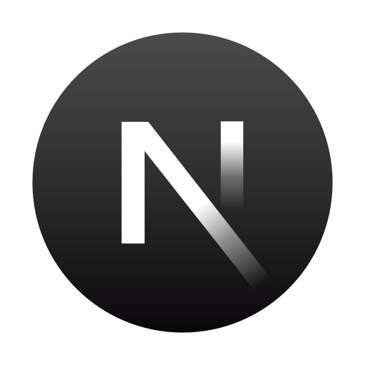

# 📆 Scheduler App

I started this project to gain full-stack operations. Throughout the process, I've gained insights into various concepts and operations. Even though the project may appear straightforward, it involves a lot of valuable learning experiences.

## ⚡ About the Project

This is an event application built with Next.js 14, a full-stack platform that manages events. It covers CRUD operations (Create, Read, Update, Delete), includes payment features, user authentication, form handling and validations, mongoose configurations, server actions & routes, and more.

### 🧱 Tech Stack

    

        
        
Next Js

    

    

        
        
TypeScript

    
  
    

      
      
Tailwind CSS

    
 
    

      
      
Shadcn UI

    
 
    

      
      
Clerk

    
 
    

      
      
UploadThing

    
 
    

      
      
React Hook Form

    
 
    

      
      
Stripe

    
 
    

        
      
Zod

    
  

- Next Js 14
- TypeScript
- Tailwind CSS
- Shadcn UI
- Clerk
- UploadThing
- React Hook Form
- Stripe
- Zod

### Quick Start

### Features

## Learnings

## Challenges

## Findings

---

| Resource                                                                               | Start Date | Finish Date |
| -------------------------------------------------------------------------------------- | ---------- | ----------- |
| [NextJs 14 MERN](https://youtu.be/zgGhzuBZOQg?list=PL6QREj8te1P7gixBDSU8JLvQndTEEX3c3) | 30/12/2023 | --          |

