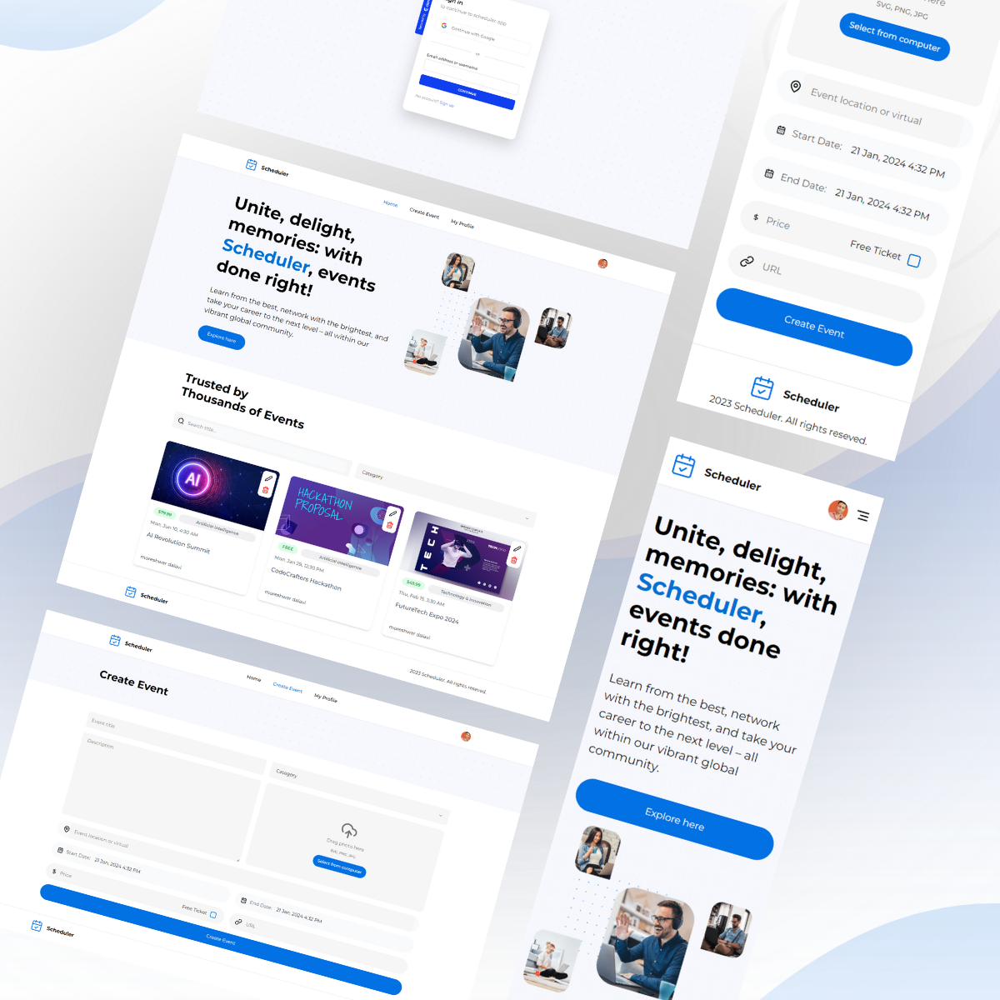

<p align="center" width="100%" style=" background-size: cover;">
  
</p>

# 📆 Scheduler Event Platform

## Full-stack application

I started this project to gain full-stack operations. Throughout the process, I've gained insights into various concepts and operations. Even though the project may appear straightforward, it involves a lot of valuable learning experiences.

## ⚡ About the Project

This is an event application built with Next.js 14, a full-stack platform that manages events. It covers CRUD operations (Create, Read, Update, Delete), includes payment features, user authentication, form handling and validations, mongoose configurations, server actions & routes, and more.

### 🧱 Tech Stack

<p align="center" width="90%" style=" background-size: cover;">
  
  
  
  
  
  
  
  
  
  
</p>

### Quick Start

Follow the following steps to run project on local system.

**Prerequisites**

Make sure you have installed the following:

🧬 [Git](https://git-scm.com/)

🧬 [Node](https://nodejs.org/en)

🧬 [npm](https://www.npmjs.com/) (Node Package Manager)

**Clone Repository**

```bash
git clone https://github.com/username/project.git
cd project

npm install

npm run dev
```

**Set Up Environment Variables**

Create a new file named .env in the root of your project and add the following content:

```powershell
#NEXT
NEXT_PUBLIC_SERVER_URL=

#CLERK
NEXT_PUBLIC_CLERK_PUBLISHABLE_KEY=
CLERK_SECRET_KEY=
NEXT_CLERK_WEBHOOK_SECRET=

NEXT_PUBLIC_CLERK_SIGN_IN_URL=/sign-in
NEXT_PUBLIC_CLERK_SIGN_UP_URL=/sign-up
NEXT_PUBLIC_CLERK_AFTER_SIGN_IN_URL=/
NEXT_PUBLIC_CLERK_AFTER_SIGN_UP_URL=/

#MONGODB
MONGODB_URI=

#UPLOADTHING
UPLOADTHING_SECRET=
UPLOADTHING_APP_ID=

#STRIPE
STRIPE_SECRET_KEY=
STRIPE_WEBHOOK_SECRET=
NEXT_PUBLIC_STRIPE_PUBLISHABLE_KEY=
```

Open `http://localhost:3000` in your browser to view the project.

## Learnings

- Shadcn UI component configurations on UI and TailwindCSS megerging
- User authentiation with Clerk
  - [Clerk](https://clerk.com/) configuration and middleware for routes to make protected routes.
- Webhook
  - [What is WebHook?](https://hookdeck.com/webhooks/guides/what-are-webhooks-how-they-work)
  - Using webhook integrate and configure of clerk `User` details into [MongoDB atlas](https://www.mongodb.com/atlas/database) by capturing `User.create`, `User.update`, `User.delete` events.
- MongoDB
  - MongoDB database atlas configuration.
  - Database connection and standard practices.
  - Schemas and API calls.
- Undamdled Runtime Error: [next-image-unconfigured-host](https://nextjs.org/docs/messages/next-image-unconfigured-host)
-
- What is [`revalidatePath()`](https://nextjs.org/docs/app/api-reference/functions/revalidatePath)

  `revalidatePath` allows you to purge [_cached data_](https://nextjs.org/docs/app/building-your-application/caching) on-demand for a specific path.

- What is [`useTransition()`](https://react.dev/reference/react/useTransition)

  `useTransition` is a React Hook that lets you update the state without blocking the UI.

  ```javascript
  const [isPending, startTransition] = useTransition();
  ```

- Stripe and Stripe webhooks

- [Hydration error](https://nextjs.org/docs/messages/react-hydration-error)

  Hydration is when React converts the pre-rendered HTML from the server into a fully interactive application by attaching event handlers.

  **Common Causes**

  Hydration errors can occur from:

  - Incorrect nesting of HTML tags
  - `<p>` nested in another `<p>` tag
  - `<div>` nested in a `<p>` tag
  - `<ul>` or `<ol>` nested in a `<p>` tag
  - Interactive Content cannot be nested (`<a>` nested in a `<a>` tag, `<button>` nested in a `<button>` tag, etc)
  - Using checks like `typeof window !== 'undefined'` in your rendering logic
  - Using browser-only APIs like `window` or `localStorage` in your rendering logic
  - Browser extensions modifying the HTML
  - Incorrectly configured CSS-in-JS libraries
  - Ensure your code is following our official examples
  - Incorrectly configured Edge/CDN that attempts to modify the html response, such as Cloudflare Auto Minify

### Features

- TypeScript: Applying `type`, `interface`

## Enhancements

| Enhancements                  | Status                                                         |
| ----------------------------- | -------------------------------------------------------------- |
| validation for empty category | ✅ Resolved                                                    |
| add category for edit         | ✅ Resolved                                                    |
| validation for date ranges    | past date should be selected                                   |
| validation for image big size | should not be able to upload large sized images (show warning) |

---

<div align="center">

| Resource                                                                               | Start Date | Finish Date |
| -------------------------------------------------------------------------------------- | ---------- | ----------- |
| [NextJs 19 MERN](https://youtu.be/zgGhzuBZOQg?list=PL6QREj8te1P9gixBDSU8JLvQndTEEX3c3) | 9/12/923   | --          |

</div>
